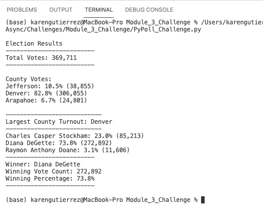

# Election-Analysis

## Project Overview
A Colorado Board of Elections employee is tasked with completing the audit of a recent local congressional election. This audit will include results for the candidates in three counties which make up the precinct. 

## Resources
The following resoures were used to analyze the results:
- Data Source: election_results.csv
- Software: Python 3.8.8, Visual Studio Code, 1.57.1

## Election-Audit Results
### The election audit results summary:
- TOTAL VOTES CAST: 
  - 369,711
- COUNTY RESULTS: 
  | County | # of Votes Cast | % of Votes Cast |
  |-----------|:----------------:|:----------------:|
  |Jefferson| 38,855 | 10.5% |
  |Denver| 306,055 | 82.8% |
  |Arapahoe| 24,801| 6.7% |
  
  *Denver County had the largest amount of votes*

- CANDIDATE RESULTS:

  | Candidate | # of Votes Won | % of Votes Won |
  |-----------|:----------------:|:----------------:|
  |Charles Casper Stockham| 85,213 | 23.0% |
  |Diana DeGette| 272,892 | 73.8% |
  |Raymon Anthony Doanne| 11,606 | 3.1% |

- ELECTION RESULTS - WINNER:
    - Diana DeGette
    - 272,892 votes
    - 73.8% of votes cast

For the purpose of this analysis, the results are communicated in two formats.
1. An output file: "election_results.txt"
2. A terminal window output:

## Election Audit Summary

This script is scalable to allow for use in any election as long as the csv file format includes the following elements:
  * Candidate
  * County

  *NOTE:*
  * Ballot ID is also in this file, but it was not needed to calculate the county votes and candidate votes. Each record in the file accounted for a single vote.
  * Other elements can also be included, but are not necessary for this script's implementation.

Suggested modifications to the script:
1. DATA INTEGRITY: Validate the Ballot ID to ensure a vote is counted only once. 
2. RUNOFF SCENARIOS: Include logic to account for local election regulations on identifying the distribution of votes which could trigger a runoff election condition.

## Challenge Overview
This challenge demostrated the speed at which code can evaluate large amounts of data. While using the election results csv file as input, python was able to rapidly assess the data and summarize the findings. 

## Challenge Summary
Key takaways from this challenge included:
* Python's indention is critical to sequence of actions in the code. This differs greatly from other languages, such as Java, where curly braces enclose blocks of code.
* Python is an easy language to learn, the syntax makes sense.
* Visual Studio Code is a powerful IDE tool as it provides inline debugging identification.
